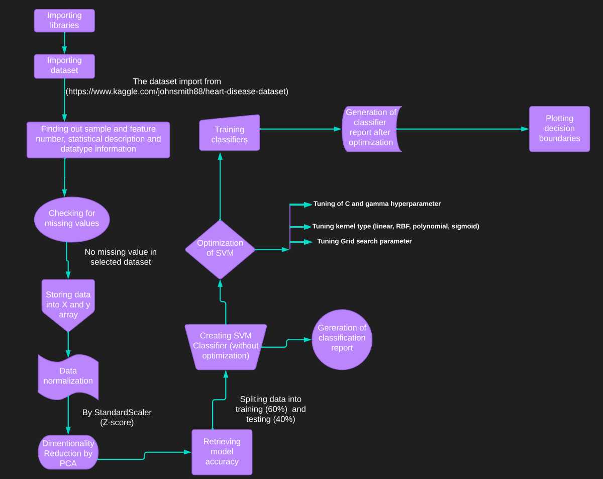
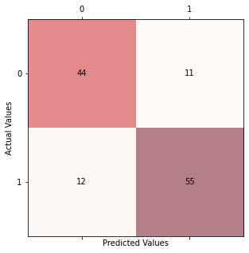
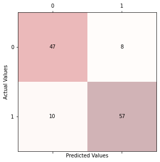
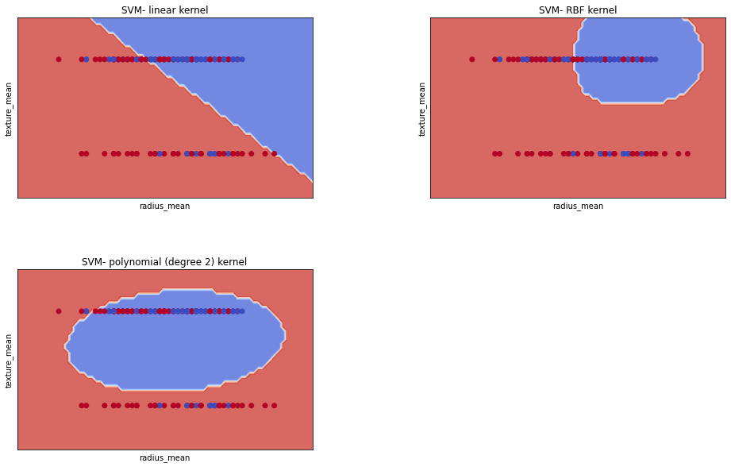

# Optimization of Support Vector Machine (SVM) Classifier
Support vector machine (SVM) is one of the most popular classifer which deals with the classification and regression problem with strong generalization capabilities. Optimization of SVM can be done by tuning of SVM parameters.

 
*Basic work flow*

  

#### Optimization 
- Optimization is done by
- -------------------------------------------------------------------
------------------------------------------------------------------------
- tuning the following kernel type:
     - SVM-linear
     - SVM-polynomial 
     - SVM-RBF (Gaussian radial basis function) 
     - SVM- sigmoid

- Tuning of C and gamma hyperparameter

      'C': np.logspace(-3, 2, 5), 'gamma': np.logspace(-3, 2, 5)
- 8 fold Grid search cross validation

## Result analysis

#### Confusion matrix analysis

       

Figure 1.1. Confusion matrix of Support Vector Machine (SVM) without optimization.

Here,

- 44 patients are predicted correctly without heart disease.

- 11 patients are wrongly predicted without heart disease.

- 12 patients are wrongly predicted with heart disease.

- 55 patients are predicted correctly with heart disease.

       

Figure 1.2. Confusion matrix of Support Vector Machine (SVM) after Optimization.

Here,

- 47 patients are predicted correctly without heart disease.

- 8 patients are wrongly predicted without heart disease.

- 10 patients are wrongly predicted with heart disease.

- 57 patients are predicted correctly with heart disease.

####Classification report Comparison:
 

   |   Classification report      | 0= without heart disease [without optimization] | 1= with heart disease [without optimization] | 0=without heart disease [with optimization] | 1= with heart diasease [with optimization] |
   |:------------------------------------------------|:---------------------------------------------|:--------------------------------------------|--------------------------------------------|----------------                                     |
   | precision  | 0.79                                            | 0.83                                         | 0.82                                        | 0.88
   |  recall | 0.80                                            | 0.82                                         | 0.85                                        | 0.85                                       |
   | f1-score | 0.79                                            | 0.83                                         | 0.84                                        | 0.86                                       |
     
 
#### Comparison among the Accuracy:
| SVM Accuracy without optimization              | SVM Accuracy with optimization                               |
   | :---------------------------------- | :----------------------------------------------------------- |
   | 0.81  | 0.85 |
  

#### Decision boundary of SVM-linear, SVM-RBF and SVM-polynomial (2-degree) kernel

  

Decision boundary has been generated by taking first two features and by ploting the training points.

##### Other Optimization techniques include:
- Random optimization
- Bayesian optimization

